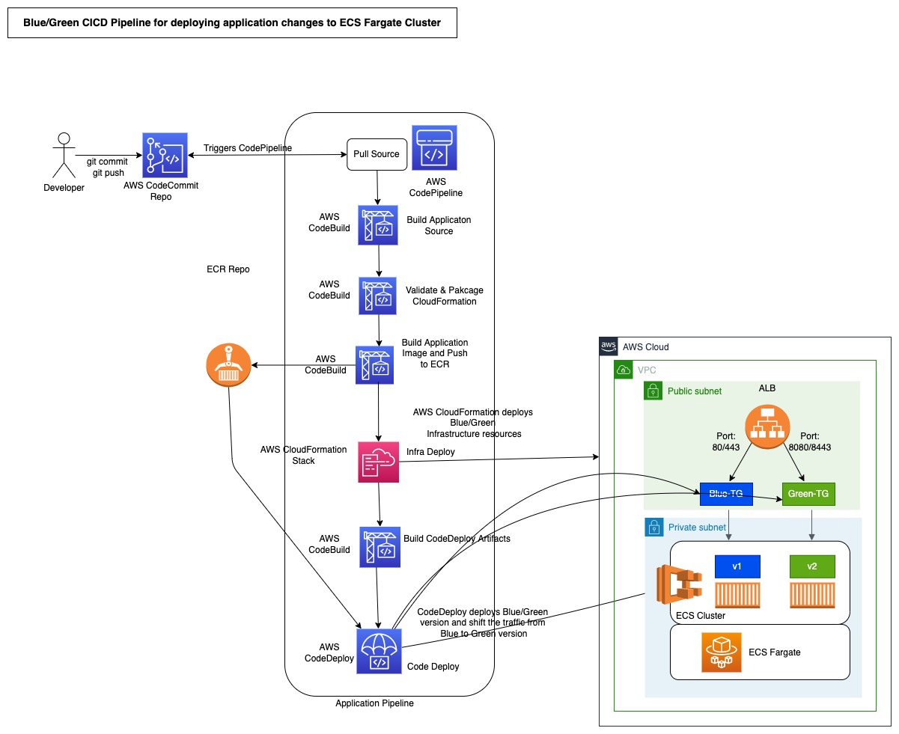

# Blue/Green Deployment for ECS Fargate application using CloudFormation and CodePipeline
Many customers use ECS for running their mission critical container-based applications on AWS. These customers want to leverage the benefits of CodeDeploy based blue/green deployments and rollbacks for their application updates in an automated way through a CICD pipeline. There are severals ways on how customers can do Blue/Green deployments for their ECS based workloads. In this pattern we present a solution which customer can use to fully automate Blue/Green deployments for their application on AWS. This solution supports CloudFormation nested stacks and allows application teams to update infrastructure and application code in the same pipeline. Using this solution customers can quickly create a CI/CD pipeline that can build their application, deploy the infrastructure components for their application and perform blue/green deployment using CodeDeploy. This solutions can also be used by customers that cannot use the CloudFormation’s blue/green deployment capability due to considerations that are outlined here

As part of the solution, we provide CloudFormation resources to create the necessary CodeDeploy components for Blue/Green deployment on ECS. We then integrate these components in CloudFormation templates to build out the application infrastructure and provide a reference CodePipeline implementation that fully orchestrates the application build, test and deploy stages. As part of the solution we demonstrate how you can build an automated CI/CD pipeline that fully orchestrates Blue/Green deployment using Linear, Canary and All-at-once traffic shifting patterns for a java based reference application. The solution includes the CloudFormation templates to create an ECS based application infrastructure, the necessary CodeDeploy components and an CodePipeline to orchestrate the application and infrastructure build, infrastructure deploy and application deploy using CodeDeploy’s blue/green deployment capability.

## Architecture

In this solution, we use a sample java HelloWorld application running on Apache Tomcat and demonstrate how you can create a CICD pipeline using AWS CodePipeline to fully orchestrate the application build, application infrastructure CloudFormation template validation, application infrastructure setup and application blue/green deployment using AWS CodeDeploy. 

The sample CodePipeilne provided as part of this solution, consists of the below stages

1. Source: In this stage the CodePipeline pulls changes pushed to the application repository in CodeCommit

2. Application Build: In this stage the CodePipeline triggers CodeBuild to build the application using maven which in turn generate the application war file.

3. Build Application Docker Image: In this stage the CodePipeline triggers CodeBuild to build the application docker image and publish that docker image to ECR.

4. Infrastructure Build and Validation: In this stage, CodePipeline will validate the infrastructure CloudFormation templates and package the nested CloudFormation templates and lambda function for deployment

5. Deploy Application Infrastructure: In this stage, CodePipeline deploys the application Infrastructure using CloudFormation action

6. Build CodeDeploy deployment artifacts: In this stage, we build the CodeDeploy appspec.yml file with the updated task definition to initiate Blue/Green deployment using CodeDeploy

7. Deploy Application: In this stage, CodePipeline uses the CodeDeploy ECS deployment action to create a Blue/Green deployment of the application. 

## Solution Deployment

### Deployment Prerequisites
1. VPC with atleast two public and two private subnets. 
2. Route53 public hosted zone available in the account where the application will be deployed
3. Amazon Certificate Manager (ACM) certificate valid for the Route53 domain created in step 2.
4. Email address where application alerts will be sent to

### Depolyment steps
1. Ensure that you have setup everything that is listed in the pre-requisites section
2. Download source code from this repo
2. Update the **ecs-bg-params.json** under **iac/app/params** folder with the values for resources listed in the pre-requisite section
4. Deploy the CodePipeline CloudFormation template under **iac/pipeline/code-pipeline.yaml**
5. The above CodePipeline template will create a Code Commit repository. Retrieve the repository clone url from the output of the CodePipeline stack deployed in step #4
6. Push the updated code to this code commit repository which will trigger the code pipeline. Wait till pipeline successfully deploys and then verify the application is functional by going to the application URL. The application URL can be obtained from the Output of the CloudFormation application infrastructure stack (ecsfargate-sampleapp-infra-stack) that is deployed by Code pipeline execution.

## Testing/Validation

Verify How changes to the application are deployed to ECS Cluster using CodeDeploy Blue/Green Canary deployment pattern and Rollback if CodeDeploy LifeCycle Hook fails

### Validation/Testing for the Successful deployment
For Testing Blue/Green deployment of application changes follow the steps below

1. Udate the application version in the application source code. To do that open **src/main/java/Hello.java** and change the **appVersion** to 2 and **welcomeMsg** as “Welcome to the Hello World App” as follows:
public static String appVersion = "2";
public static String welcomeMsg = "Welcome to the Hello World App";

2. For Successful Testing, **welcomeMsg** string value from **src/main/java/Hello.java** should exactly match with **pAppTestingExpectedString** string value from **iac/params/ecs-bg-params.json**
"pAppTestingExpectedString":"Welcome to the Hello World App"

3. Commit and push these changes to the remote CodeCommit Repository which will trigger the pipeline to execute. The pipeline will build the new application image and then push that to ECR. Wait till the pipeline reaches the StartBlueGreen deploy stage.

4. When the pipeline reaches the StartBlueGreenDeploy stage, navigate to the CodeDeploy console to observe the steps that CodeDeploy performs.

   The StartBlueGreenDeploy will create a new Deployment in the CodeDeploy Service. The CodeDeploy deployment will deploy new ECS Green Replacement task  with the new task definition to replace the Original ECS Blue Task using the old task definition.

   Automated Validation will be performed by CodeDeploy AfterInstall LifeCycle Hook configured by iac/app/templates/codedeploy-afterinstallhook-lambda.yaml which compares and validates that welcomeMsg string value from src/main/java/Hello.java is exactly matching with pAppTestingExpectedString string value from iac/params/ecs-bg-params.json

   After deploying the ECS Green Replacement Task along with successful automated validation by CodeDeploy AfterInstall Lifecycle Hook, CodeDeploy uses Canary Deployment method to shift 10% Production traffic to the Green Replacement Task and after waiting for 10mins it shifts rest 90% Production traffic to the ECS Green Replacement Task. Before shifting the traffic, CodeDeploy will invoke LifeCycle hook lambda which will validate the application.

4. Wait for CodeDeploy deployment to succeed.

5. Navigate to your application URL, verify that you should see the new Version 2 of the application.

### Validation/Testing for the Rollback deployment
1. To create a Rollback scenario, add/commit a string value for src/main/java/Hello.java mismatched with the string value for **welcomeMsg** string in iac/params/ecs-bg-params.json as follows:
public static String appVersion = "2";
public static String welcomeMsg = "Welcome to the Hllo Word App";

   Note above that “Hello World” is misspelled as “Hllo Word”

2. Due to this mismatched string value, CodeDeploy AfterInstall Hook fails the validation thereby initiating the Rollback deployment to **appVersion = “1”** with following error:
“The deployment failed because one or more of the lifecycle event validation functions failed.”

3. Traffic is shifted to original Blue Tasks and new Replacement Green Tasks are removed.

4. As a result CodePipeline stage StartBlueGreenDeploy with action StartApplicationDeploy resulted to a Failed state.

5. After the successful Rollback Deployment, Navigate to your application URL, verify that you should see the new Version 1 of the application. 
